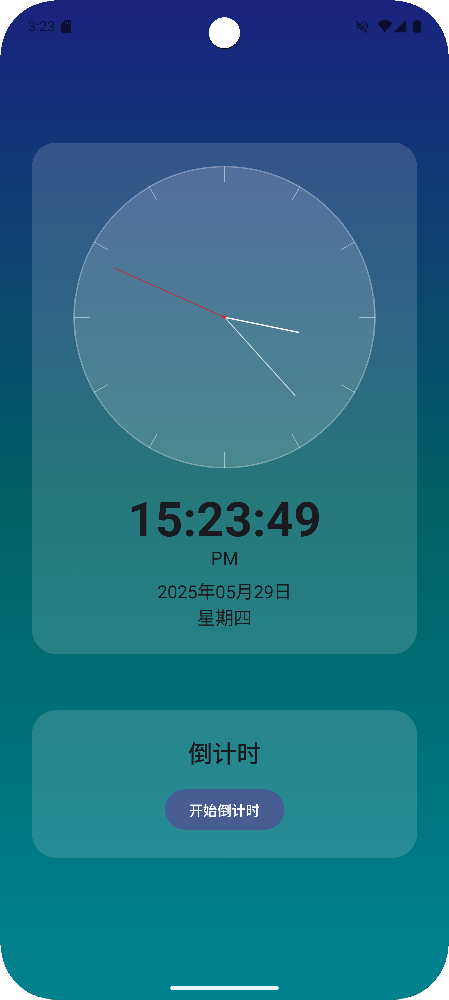

# ModernClock

一个现代化的 Android 时钟应用，使用 Jetpack Compose 构建，具有优雅的 UI 设计和实用的功能。



## 功能特点

- 🕐 模拟时钟显示
- 📱 数字时间显示
- 📅 日期和星期显示
- ⏱️ 倒计时功能
- 🎨 磨砂玻璃效果界面
- 🌈 渐变背景
- 🌓 支持深色/浅色主题

## 技术栈

- Kotlin
- Jetpack Compose
- Material Design 3
- MVVM 架构
- Kotlin Coroutines
- StateFlow

## 项目结构

```
app/
├── src/
│   ├── main/
│   │   ├── java/com/example/modernclock/
│   │   │   ├── components/           # UI 组件
│   │   │   │   ├── AnalogClock.kt    # 模拟时钟组件
│   │   │   │   ├── FrostedCard.kt    # 磨砂玻璃卡片组件
│   │   │   │   └── GradientBackground.kt # 渐变背景组件
│   │   │   ├── ui/theme/            # 主题相关
│   │   │   │   ├── Color.kt         # 颜色定义
│   │   │   │   ├── Theme.kt         # 主题配置
│   │   │   │   └── Type.kt          # 字体样式
│   │   │   ├── MainActivity.kt      # 主活动
│   │   │   └── ClockViewModel.kt    # 视图模型
│   │   └── res/                     # 资源文件
│   │       └── font/                # 字体文件
└── build.gradle.kts                 # 应用级构建配置
```

## 开始使用

### 环境要求

- Android Studio Hedgehog | 2023.1.1 或更高版本
- Android SDK 34 或更高版本
- Kotlin 1.9.0 或更高版本

### 安装步骤

1. 克隆项目
```bash
https://github.com/WilliamZ1008/ModernClock
```

2. 在 Android Studio 中打开项目

3. 等待 Gradle 同步完成

4. 运行应用

## 使用说明

### 时钟显示
- 模拟时钟显示当前时间
- 数字时钟显示精确时间
- 显示当前日期和星期

### 倒计时功能
1. 点击"开始倒计时"按钮
2. 在弹出的对话框中输入分钟数
3. 点击"确定"开始倒计时
4. 可以随时点击"停止倒计时"按钮终止倒计时

## 自定义主题

应用支持深色和浅色主题，可以通过系统设置自动切换。主题包括：

- 渐变背景
- 磨砂玻璃效果
- 自定义字体
- Material Design 3 组件

## 贡献指南

欢迎提交 Pull Request 或创建 Issue 来改进项目。在提交代码前，请确保：

1. 代码符合 Kotlin 编码规范
2. 添加必要的注释
3. 更新相关文档

## 许可证

本项目采用 MIT 许可证 - 详见 [LICENSE](LICENSE) 文件

## 致谢

- [Jetpack Compose](https://developer.android.com/jetpack/compose)
- [Material Design 3](https://m3.material.io/)
- [Noto Sans SC](https://fonts.google.com/noto/specimen/Noto+Sans+SC) 